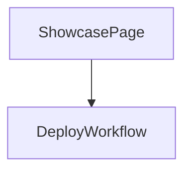

## 1. Stack
- Plain HTML5, single self-contained file (`index.html`) — no framework, no build step (README.md:5).
- CSS: inline `<style>` block using CSS custom properties for design tokens (index.html:9-21).
- JS: vanilla, inline `<script>` for mobile-menu toggle only (index.html:592-603).
- Deploy: GitHub Actions workflow to GitHub Pages (`.github/workflows/deploy.yml`, README.md:10).
- No package manager / manifest present at repo root.

## 2. Directory map
| path | what lives there |
|---|---|
| `index.html` | the entire showcase site — head/meta, inline CSS, all page sections, inline JS (index.html:1-605) |
| `README.md` | deploy-bundle instructions: what's inside, how to push to a separate repo, GitHub Pages setup notes |
| `.github/workflows/` | `deploy.yml` — publishes this folder to GitHub Pages on push to `main` (README.md:10) |

## 3. Diagram

## 4. Component index
- [[ShowcasePage]]
- [[DeployWorkflow]]

## 5. Entry points
- Dev: open `REPO_ROOT/index.html` directly in a browser — "no build step" (README.md:5).
- Prod: `REPO_ROOT/index.html` served by GitHub Pages after `.github/workflows/deploy.yml` runs on push to `main` (README.md:10, 21-32).

## 6. Conventions
- Whole site is one self-contained file: all CSS lives in `<head><style>` (index.html:9-202), all JS lives in one `<script>` before `</body>` (index.html:592-603).
- Design tokens (colors, radius, shadow, font stacks) defined as CSS custom properties on `:root` (index.html:10-21).
- Section-per-feature layout: each `<section id="...">` in `<main>` corresponds to one nav entry (`#why`, `#story`, `#who`, `#tech`, `#screens`, `#location`, `#contact`) matched against `.navlinks` anchors (index.html:218-229, 279-577).
- Icons are inline `<svg>` markup or emoji characters, not an icon font/library (index.html:210-217, 342-347).
- `.wrap` is the single max-width/padding container class reused across all sections (index.html:29).

## 7. Where things go
- Add a new showcase section: add a `<section id="...">` block inside `<main>` in `index.html`, then add a matching `<a href="#...">` in `.navlinks` (index.html:218-229).
- Update site copy or preview data: edit the relevant markup directly in `index.html` — "edit `index.html`, commit, and push" (README.md:42).
- Restyle the page: edit the CSS custom properties in the `:root` block (index.html:10-21).
- Change deploy trigger/target: edit `.github/workflows/deploy.yml` — triggers on push to `main` or manual `workflow_dispatch`, uploads repo root `.` as the Pages artifact (deploy.yml:6-9,34-35).
- Re-deploy to a fresh repo: copy `index.html` and `.github/workflows/deploy.yml` so `index.html` sits at the new repo's root (README.md:14-20).
